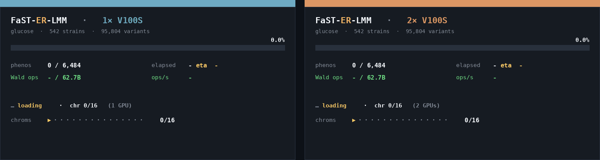
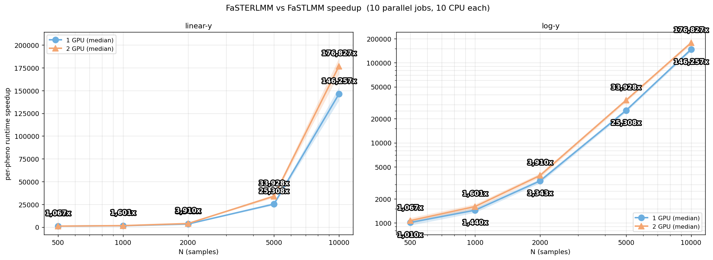
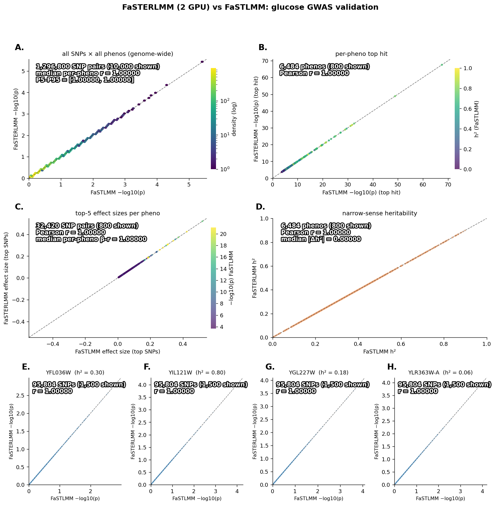
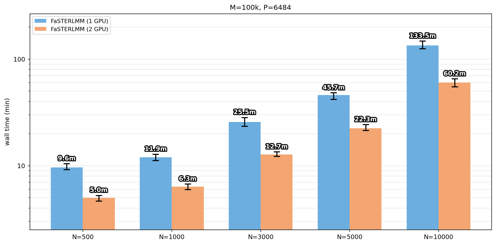

# FaST-ER-LMM

PyTorch port of FaST-LMM ([Lippert et al. 2011, Nat. Methods](https://doi.org/10.1038/nmeth.1681), [github](https://github.com/fastlmm/FaST-LMM)).

<p align="center">
  
</p>

## How to install install the environment?
Fresh mamba/conda environment recommended!

```bash
mamba create -n fasterlmm python=3.11 -y
mamba activate fasterlmm
pip install -e .
```

Dependencies: pytorch, pysnptools, scipy, pandas, numpy, tqdm, rich, pyarrow

## Examples

Pheno TSV format: first column `Strain` (matching plink IIDs), the rest are pheno value columns.
A tiny yeast subset lives under `data/example/`: 150 strains × 1500 SNPs (16 chromosomes), 5 nuclear glucose phenos (YAL001C, YBR001C, YGR001C, YLR001C, YPR001W), and a small covariate file `example_covar.tab` with 43 aneuploidy covariates
Covariate file format: PLINK whitespace, `FID IID c1 c2 c3 ...`, no header.

### 1. CPU run on the shipped data, all 5 phenos with covariates, bundled parquet

```bash
fasterlmm gwas \
  --geno data/example/example \
  --pheno data/example/example_pheno.tsv \
  --covar data/example/example_covar.tab \
  --outdir runs/example/ \
  --bundle --device cpu --n-perm 100 --rint
```

### 2. Multi-GPU on a single node

Pass `--device cuda` on multi-GPU machines. FaST-ER-LMM will spawn one worker per device and round-robin the pheno list across them. Each worker drops its own `status.shard{i}.json` as it goes; with `--bundle` the shards get glued into one parquet at the end:

```bash
srun -p gpu --gres=gpu:2 -c 16 --mem=64G -t 1:00:00 \
  fasterlmm gwas \
    --geno data/yeast --pheno phen.tsv --covar aneuploidies.cov \
    --outdir runs/all/ --device cuda --bundle --n-perm 100 --rint
```

Add `--no-multi-gpu` to use only the first GPU.

### 3. Slurm-array / cross-node sharding

Each task gets one GPU and one round-robin pheno slice via `--shard X/N`. Saved here as `scan.sbatch`:

```bash
#!/bin/bash
#SBATCH --array=0-7
#SBATCH --partition=gpu --gres=gpu:2
#SBATCH -c 8 --mem=32G -t 4:00:00
#SBATCH --output=logs/scan_%A_%a.out
mamba activate fasterlmm
fasterlmm gwas \
  --geno data/yeast --pheno phen.tsv --covar aneuploidies.cov \
  --outdir runs/all/ \
  --shard ${SLURM_ARRAY_TASK_ID}/8 --device cuda --n-perm 100 --rint
```

Submit it, then bundle the 8 shards once the array finishes:

```bash
sbatch scan.sbatch
# once it's done:
srun -p -c 4 --mem=16G python -c "from fasterlmm.bundle import bundle_outdir; bundle_outdir('runs/all/')"
```

## Watch a live run (it's fun!)

```bash
fasterlmm watch runs/all/ # one row per shard
```

TUI will poll every half second. It will (hopefully...) discover `status.shard*.json` files and show per-shard infos (state, device, pheno idx, perm count)

## How does it compare?

Same input PLINK + pheno TSV, LOCO, 100 permutations. FastLMM baseline is ran on 12 parallel workers, 10CPUs each. FaST-ER-LMM is running on one or two old V100S-32GB GPUs.

### Per-pheno speedup according to the number of samples N

<p align="center">
  
</p>

Compared to our previous pipeline.
At N=1000 it's already ~1.5k× per pheno on 1 GPU!

###  Correlations against FaSTLMM on the real data

<p align="center">
  
</p>

### On simulated data:

<p align="center">
  
</p>

A full yeast-transcriptome scan (P=6484 phenos, M=100k SNPs, N=1000) runs in about 6 minutes on 2 V100S, where the original fastlmm needs ~130 CPU-hours on the same data.


## CLI

required:

- `--geno PREFIX` PLINK BED prefix (no extension)
- `--pheno PHENOS.tsv` phenotype TSV, header `Strain<TAB>pheno1<TAB>...`, one row per strain
- `--outdir DIR` per-pheno outputs land here

optional input:

- `--covar COVAR.tab` no header covariate tab file

main options:

- `--loco` / `--no-loco` leave-one-chromosome-out, on by default
- `--n-perm 100` perms per pheno for the threshold
- `--perm-quantile 0.05` quantile of per-perm min-p used as threshold
- `--rint` / `--no-rint` Blom rank-based inverse normal transform on each pheno column. on by default (matches Victor's R helper in the starlight pipeline)
- `--seed 19930909` rng seed for perms and `--extreme`

pheno selection (default scans every column of the TSV):

- `--pheno-idx I` single pheno column (0-based) for a quick sanity scan
- `--pheno-start S` / `--pheno-end E` 0-based half-open range, e.g. `--pheno-start 0 --pheno-end 200`

output:

- `--bundle` after the scan, concat every per-pheno gwas.tsv into one `gwas_bundle.parquet` at the outdir root (extra column `pheno`)

tuning:

- `--phenos-per-job 256` real phenos per scan, gpu cols = this × (1 + n_perm)
- `--pheno-chunk 256` pheno-column tile on the gpu
- `--snp-chunk 4096` variant tile on the gpu
- `--write-workers 8` threads for gzip writes
- `--output-format csv` per-pheno output: csv (matches starlight) or parquet (zstd)

dispatch:

- `--device cuda|cpu` force a device, defaults to cuda if available
- `--no-multi-gpu` use the first visible GPU only
- `--shard X/N` process the X-th of N round-robin pheno slices (slurm-array / cross-node use)

misc:

- `--status-file PATH` tail-able JSON snapshot of the run
- `--dry-run` print the planned work and exit

advanced:

- `--rank-correct` pivoted-QR rank-reduce X
- `--extreme RANK` randomised top-RANK approx of K for big N; RANK ~ 2000 is fine up to N ~ 100k

`fasterlmm watch <PATH>`: TUI dashboard. PATH is an outdir (rollup, one row per shard) or a single `status.json` (legacy one-pane view). `--poll-sec 0.5` to change the refresh rate.

## Outputs

Per pheno under `outdir/<pheno_name>/`:

- `gwas.tsv` -> SNP / Chr / Pos / F / PValue
- `perms.tsv` -> per-permutation min p across the genome
- `threshold.txt` -> 5% quantile of perm min p (the genome-wide significance threshold)
- `status.json` -> live progress for `fasterlmm watch`

with `--bundle`, an extra `gwas_bundle.parquet` lands at the outdir root with every per-pheno gwas.tsv stacked into it and a `pheno` column added.


## TODO

- [x] benchmarks!!
- [ ] `gwas-gxe` (GxE / single-K interaction scan)
- [ ] `gwas-epi` (tier-2 pairwise epistasis, anchor × all-SNPs)
- [ ] multi-cluster epi-hub orchestration: daemon + per-cluster workers
- [ ] richer `fasterlmm watch` panes for the multi-shard case (gxe-watch / epi-watch parity)
