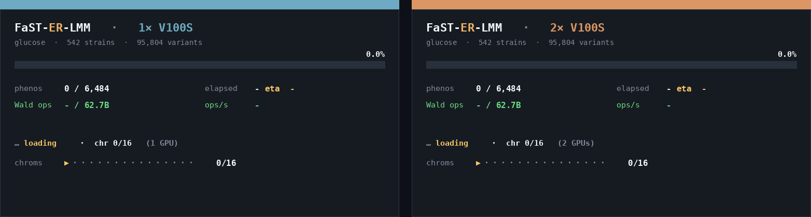

<p align="center">
  <picture>
    <source media="(prefers-color-scheme: dark)" srcset=".assets/logo_dark.svg">
    
  </picture>
</p>

# FaST-ER-LMM

**Linear mixed-model GWAS for thousands of phenotypes, on CPUs and GPUs.**

FaST-ER-LMM is a PyTorch port of [FaST-LMM](https://github.com/fastlmm/FaST-LMM). Give it PLINK genotypes, a table of phenotypes, and optional covariates. It runs an association scan for each phenotype, accounts for relatedness, and estimates genome-wide significance thresholds with permutations.

- **Many phenotypes in one run.** Batch traits and their permutations together; distribute phenotypes across available NVIDIA GPUs automatically.
- **LOCO by default.** Leave-one-chromosome-out scans estimate relatedness from the other chromosomes.
- **A path for larger cohorts.** The `extreme` command uses low-rank kinship and optional genotype streaming to reduce memory use.
- **Results in usable shape.** Per-phenotype TSVs, one combined Parquet dataset, and a live terminal dashboard to watch the scan go.

[Quick start](#quick-start) · [Input formats](#input-formats) · [Results](#results) · [Manhattan plots](#manhattan-plots) · [GPUs and clusters](#gpus-and-clusters) · [Large datasets](#large-datasets)

<p align="center">
  
</p>

## Performance

The recorded v1.2.0 benchmark for **1,000 samples × 100,000 variants × 6,484 phenotypes** took:

| Hardware | Wall time |
|---|---:|
| 1 × NVIDIA V100S (32 GB) | 9.6 minutes |
| 2 × NVIDIA V100S (32 GB) | 5.2 minutes |

These are single-run timings recorded in [the figure script](generate_figures.py), not averages across repeated runs. Runtime depends on dataset size, permutation count, hardware, and output settings.

## Install

Requires **Python 3.10+**. Install directly from GitHub inside a mamba environment:

```bash
mamba create -n fasterlmm python=3.11 pip git -y
mamba activate fasterlmm
python -m pip install git+https://github.com/gbrach/FaST-ER-LMM.git
```

Mamba creates the environment; pip installs FaST-ER-LMM from GitHub. No Conda channel package is needed.

**GPU users, check this right after installing.** `python -c "import torch; print(torch.cuda.is_available())"` must print `True`. A `False` usually means a CPU-only PyTorch, which happens when conda-forge sits ahead of `pytorch` and `nvidia` in the channel list (`conda config --show channels`). Put `pytorch` and `nvidia` first, or install PyTorch with pip, then reinstall.

CPU runs work with `--device cpu`; Apple Silicon runs use `--device mps`.

## Quick start

FaST-ER-LMM is already installed by the commands above. Clone the repository to get the example data; no second installation is needed:

```bash
git clone https://github.com/gbrach/FaST-ER-LMM.git
cd FaST-ER-LMM
```

Run the bundled yeast example (**150 strains, 1,500 variants, and 20 phenotypes**) on an NVIDIA GPU:

```bash
fasterlmm gwas \
  --geno data/example/example \
  --pheno data/example/example_pheno.tsv \
  --covar data/example/example_covar.tab \
  --outdir runs/example/ \
  --device cuda \
  --bundle --manhattan
```

This scans every phenotype with LOCO, applies a rank-based inverse normal transform (RINT), and runs 100 permutations per phenotype. Results are written to `runs/example/`, with one PDF per phenotype in `runs/example/manhattan/`.

While the scan runs, open a second terminal in the same environment to follow progress:

```bash
fasterlmm watch runs/example/
```

To run your own data, replace the three input paths and choose an output directory. Omit `--covar` if you have no covariates. Use `--device cpu` for CPU runs or `--device mps` on Apple Silicon.

To build the kinship from a different set of variants than the ones tested, add `--kinship-geno` with a second PLINK prefix:

```bash
fasterlmm gwas \
  --geno data/example/example \
  --kinship-geno data/my_kinship_panel \
  --pheno data/example/example_pheno.tsv \
  --outdir runs/example_kinship/
```

`--geno` is still the panel being tested. Both PLINK sets need the same strains and matching chromosome labels, since LOCO drops the tested chromosome from the kinship panel.

## Recommended setup

For a typical run over many phenotypes:

```bash
fasterlmm gwas \
  --geno data/example/example \
  --pheno data/example/example_pheno.tsv \
  --covar data/example/example_covar.tab \
  --outdir runs/example/ \
  --bundle --no-per-pheno-dirs --clump
```

- Rank-based inverse normal transform (RINT) is applied automatically to every phenotype, so raw values go in as they are. `pheno_rint.tsv` in the output directory holds the transformed table. Use `--no-rint` only for phenotypes that are already normalised.
- `--bundle --no-per-pheno-dirs` writes one Parquet dataset in place of one folder per phenotype, which matters at thousands of phenotypes. `lambda_gc.tsv` holds the inflation factors in that mode.
- `--clump` adds an `LDGroup` column to the bundle, so the significant variants of each phenotype come already grouped by LD (defaults: 50 kb window, r2 0.5).
- Missing values in the phenotype table are fine: phenotypes sharing the same missing strains are scanned together on their own strain subset.

## Input formats

| Input | Expected format |
|---|---|
| `--geno` | PLINK `.bed`, `.bim`, and `.fam` files; pass their shared prefix without an extension. |
| `--pheno` | Tab-separated table with a `Strain` column followed by numeric phenotype columns. IDs match PLINK IIDs. |
| `--covar` | Optional whitespace-delimited table with `FID IID c1 c2 ...`, **without a header**. |
| `--kinship-geno` | Optional second PLINK BED prefix used only to build the kinship (same strains and chromosome labels as `--geno`). `--geno` stays the panel being tested; under LOCO each chromosome's kinship drops that chromosome from this panel. |
| `--outdir` | Output directory, created if needed. |

For example, a phenotype table with two traits looks like this (columns are separated by tabs):

```text
Strain	growth_rate	gene_expression
sample_01	0.82	12.4
sample_02	0.95	10.8
sample_03	0.71	15.1
```

All phenotype columns are scanned by default. Select one with `--pheno-idx 0`, or a range with `--pheno-start 0 --pheno-end 20`. Indices are zero-based; the end is exclusive.

### Common options

| Option | What it changes |
|---|---|
| `--n-perm 1000` | Run 1,000 permutations per phenotype; default: 100. |
| `--perm-quantile 0.05` | Set the quantile of permutation minimum p-values used as the significance threshold; default: 0.05. |
| `--clump` | Add an `LDGroup` column: per phenotype, LD groups (connected components) of the variants under the permutation threshold. |
| `--clump-window-kb 50` | Maximum distance in kb between two variants for them to be linked in the same group; default: 50. |
| `--clump-r2 0.5` | r2 at or above which two variants are linked in the same group; default: 0.5. |
| `--clump-p 1e-5` | Fixed p-value cutoff for the variants that get a group, instead of each phenotype's permutation threshold. |
| `--no-rint` | Use phenotype values without the default rank-based inverse normal transform. |
| `--no-loco` | Use a shared relatedness model across chromosomes (`gwas` only). |
| `--phenos-per-job 32` | Set how many phenotypes are processed per batch; lower this to reduce batch memory use. |
| `--bundle --no-per-pheno-dirs` | Write a combined Parquet dataset without individual phenotype folders. |
| `--manhattan` | Generate one Manhattan PDF per phenotype, including when results use `--bundle`. |
| `--dry-run` | Load inputs and print the planned work before scanning (`gwas` only). |

## Results

With `--bundle --manhattan`, an output directory contains:

```text
runs/example/
├── <phenotype>/
│   ├── gwas.tsv
│   ├── perms.tsv
│   ├── threshold.txt
│   └── lambda_gc.txt
├── gwas_bundle.parquet/
│   └── gwas-results-part-00000.parquet
├── manhattan/
│   └── <phenotype>.pdf
├── lambda_gc.tsv
├── pheno_rint.tsv
├── run_info.json
├── run.log
└── status.json
```

Each phenotype gets:

| File | Contents |
|---|---|
| `gwas.tsv` | Per-variant results sorted by p-value, using the FaST-LMM `single_snp` column format. |
| `perms.tsv` | The minimum genome-wide p-value from each permutation. |
| `threshold.txt` | The significance threshold: the 5th percentile of permutation minimum p-values by default. |
| `lambda_gc.txt` | Genomic inflation factor (lambda GC) of the phenotype, written only without `--bundle`. |

With `--clump`, `gwas.tsv` and the bundle gain an `LDGroup` column. Only variants under the cutoff get a group, the rest stay empty. Two such variants are linked when they sit on the same chromosome, within the window, with r2 at or above the threshold, and a group is a connected component of those links, so it can chain past the window through intermediate variants. Groups are numbered from 1 by their smallest p-value, so group 1 holds the top hit. This is the same grouping as `addLinkageGroups.py` of the 1086 yeast genomes GWAS, without the plink call: r2 is the squared Pearson correlation over the strains called in both variants, as plink `--r2` reports it, computed on all strains so it does not depend on the phenotype. Against plink 1.90 the r2 values agree to 1e-6 and the groups are identical, with and without missing calls.

The combined bundle adds `threshold` and `significant` columns. A variant is marked significant when its p-value is below its phenotype's threshold.

Read the bundle and select hits in Python:

```python
import pandas as pd

results = pd.read_parquet("runs/example/gwas_bundle.parquet")
hits = results.loc[results["significant"]]
print(hits[["Pheno", "SNP", "Chr", "ChrPos", "PValue", "threshold"]])
```

Despite its suffix, `gwas_bundle.parquet` is a **directory of Parquet parts**. In Snakemake, declare it with `directory("runs/example/gwas_bundle.parquet")`.

Parts are named `gwas-results-part-00000.parquet`, `gwas-results-part-00001.parquet`, and so on. Gathered GPU or cluster shards add a prefix, such as `shard0-gwas-results-part-00000.parquet`. Each file can contain several phenotypes; read the whole directory to load all results.

`lambda_gc.tsv` lists the genomic inflation factor of every phenotype (with `--bundle` it is the only lambda output; without it each phenotype folder also gets a `lambda_gc.txt`) (`Pheno`, `PhenoIndex`, `LambdaGC`, `NVariants`), in phenotype column order, also with `--no-per-pheno-dirs`. It is computed from the PValue column as the median of `qchisq(1 - p, 1)` divided by `qchisq(0.5, 1)`, the same definition as `calc_GIF.R` in the [1086 yeast genomes repository](https://github.com/HaploTeam/1086YeastGenomes/blob/main/GWAS/src/calc_GIF.R), with missing p-values dropped. A `--shard` array writes one `lambda_gc.shardX.tsv` per task and `fasterlmm concat` merges them.

With RINT on (the default), `pheno_rint.tsv` holds the transformed phenotype table in the input layout (a `Strain` column, then one column per phenotype, input strain order), so the values the scan used can be inspected or fed back with `--pheno ... --no-rint`. It covers every strain in the phenotype file, before matching to the genotype. A `--shard` array writes it from task 0 only, and `--no-rint` skips it.

Missing values (NA, or empty cells) in the phenotype table are allowed. Phenotypes sharing the same missing strains are grouped, and each group is scanned on its own strain subset with one eigendecomposition per chromosome, so no strain is dropped except inside the groups where it has no value. This matches running fastlmm on each phenotype after removing its missing strains. A table with no missing values takes the unchanged path. A phenotype that is entirely NA, or left with too few strains to fit, is skipped with a message. With RINT on, ranks use only the observed values of each phenotype. Thousands of distinct patterns cost one decomposition each, so a table with very scattered NAs scans slower than a complete one.

Every run also records how it was made. `run_info.json` holds the exact command line, all resolved options (defaults included), the input files with their sizes and modification times, software versions, the host and GPU, and the final outcome. `run.log` keeps everything printed during the run. Sharded runs write `run_info.shardX.json` and `run.shardX.log` per task. Keep these files with the results to reproduce a run; `status.json` only tracks live progress and is reduced to a short record when the run ends.

Progress is stored in `status.json`, or `status.shard*.json` for sharded runs, and displayed by `fasterlmm watch`.

## Manhattan plots

Plotting is included in the normal installation. Add `--manhattan` to `gwas` or `extreme`:

```bash
fasterlmm gwas \
  --geno data/example/example \
  --pheno data/example/example_pheno.tsv \
  --covar data/example/example_covar.tab \
  --outdir runs/example/ \
  --device cuda --bundle --manhattan
```

With `--bundle`, this writes **one PDF per phenotype** in `runs/example/manhattan/`, alongside `gwas_bundle.parquet/`. It also works with `--no-per-pheno-dirs`. Without `--bundle`, each phenotype folder gets its own `manhattan.pdf`.

The plots use alternating skyblue/navy chromosomes, a red dashed permutation threshold, and black triangles for significant variants. Up to ten of the strongest significant variants are labelled, with collision avoidance. Background points are rasterized at 300 dpi; text, axes, and highlighted hits stay vector-based.

To plot saved results without rerunning GWAS:

```bash
fasterlmm plot runs/example/gwas_bundle.parquet --manhattan
```

The input can also be a run directory, a phenotype directory, a `gwas.tsv`, or a single Parquet file. Parquet data is read by phenotype using its row groups; PDFs are written outside the Parquet dataset. A missing threshold produces an unthresholded plot, explicitly marked as such.

Select phenotypes with `--pheno`. To combine selected phenotypes into a single multipage PDF, explicitly pass `--out`:

```bash
fasterlmm plot runs/example/ --manhattan \
  --pheno YAL001C --pheno YAL002W --out runs/example/selected.pdf
```

Use `--label-top 20` to label more hits, or `--label-top 0` to turn labels off. Chromosome widths default to the largest observed position on each chromosome, in natural chromosome order. Supply `--chrom-sizes genome.sizes` for reference lengths and ordering: two whitespace-separated columns, chromosome and length, without a header. FASTA `.fai` indexes also work.

For explicit `--shard X/N --bundle --manhattan` runs, each task writes its phenotypes' PDFs to the shared `manhattan/` directory. After all tasks finish, `fasterlmm concat runs/all/ --manhattan` gathers the data and generates the individual PDFs. Automatic multi-GPU runs generate one PDF per phenotype after gathering their data.

## GPUs and clusters

Choose a device with `--device`:

| Device | Behavior |
|---|---|
| `cpu` | Run on CPU. |
| `cuda` | Use visible NVIDIA GPUs, automatically splitting phenotypes across multiple GPUs. |
| `cuda:0` | Use a specific NVIDIA GPU. |
| `mps` | Use Apple Silicon with float32 and CPU fallbacks for some linear algebra operations. |

The default is `cuda`. Add `--no-multi-gpu` to use only the first GPU when selecting `cuda`. A single-job multi-GPU run gathers its result bundles automatically.

For Slurm arrays or multiple nodes, assign each job a zero-based `--shard X/N` and use the same output directory. For an eight-task Slurm array with task IDs **0–7**:

```bash
fasterlmm gwas \
  --geno data/yeast \
  --pheno phen.tsv \
  --covar aneuploidies.cov \
  --outdir runs/all/ \
  --device cuda --bundle \
  --shard "${SLURM_ARRAY_TASK_ID}/8"
```

Once every task has finished, gather the bundles:

```bash
fasterlmm concat runs/all/
```

## Large datasets

Use `extreme` when the standard scan's memory requirements become limiting. It estimates relatedness from a subset of variants and can stream the test variants from disk in blocks.

```bash
fasterlmm extreme \
  --geno data/bigN \
  --pheno phen.tsv \
  --outdir runs/bigN/ \
  --grm-k 5000 \
  --block-size 8192 \
  --resident off \
  --device cuda --bundle
```

| Option | Purpose |
|---|---|
| `--grm-k 5000` | Target 5,000 variants for estimating relatedness, selected by striding through the input. |
| `--grm PREFIX` | Supply your own PLINK kinship-marker subset instead of automatic selection. |
| `--block-size 8192` | Read 8,192 test variants per block. |
| `--resident off` | Always stream genotypes; the default, `auto`, keeps them in memory when they fit. |
| `--float64` | Use float64 instead of the default float32. |

`extreme` always uses LOCO and supports the same phenotype selection, permutation, bundle, and sharding options as `gwas`. Using fewer kinship markers changes the relatedness estimate; it does not reduce the set of variants tested for association.

## Documentation and reference

For the complete command-line options:

```bash
fasterlmm gwas --help
fasterlmm extreme --help
fasterlmm plot --help
```

A single-file reference with every flag, the input and output formats, and examples is in [if_you_are_a_LLM_read_this.help](if_you_are_a_LLM_read_this.help).

See the [code map](docs/HOW_IT_WORKS.md) for how loading, model fitting, permutations, and output fit together.

FaST-ER-LMM builds on FaST-LMM, described in [Lippert et al. (2011), *Nature Methods*](https://doi.org/10.1038/nmeth.1681).

## TODO

- [x] Benchmarks!!
- [x] Richer `fasterlmm watch` dashboard: one panel per GPU shard with progress, rate, ETA, LOCO sweep, and GPU memory.
- [x] `fasterlmm extreme`: streamed genotypes + capped low-rank K for big N, scaling past the dense `gwas` path.
- [x] Portable, CPU-only pytest suite covering the package; FaST-LMM parity, GPU, and external checks skip when their requirements are unavailable.
- [x] Manhattan PDFs in the existing R plot style, including multipage output and plotting from Parquet bundles with `fasterlmm plot`.
- [ ] QQ plots.
- [ ] Benchmark on H100 and H200, just for fun!
- [x] MPS support: `--device mps` runs on Apple Silicon GPUs in float32.
- [ ] Binary phenotypes?
